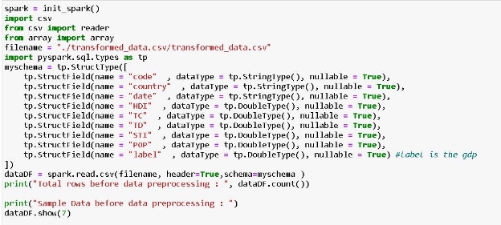

**SOEN 471 - Big Data Analytics**

**Winter 2021**

**Project: Report**

**Abstract**

The Covid-19 pandemic has led to an immense loss around the globe affecting the health care system, food system, global economy and not the least, people's mental health. There have been millions of deaths around the world. The lockdowns imposed across the world took a huge toll on the global economy. In this project, we aim to explore the impact of Covid-19 on the global economy. The dataset chosen shows the economical impact of this pandemic in 170 countries. The overall size of the data is 9.56 mb consisting of raw data (5.54 mb) and transformed data (4.03 mb). The latest information on the economy is till October 18th, 2020. The transformed data file contains 9 columns: code, country, date, human development index, total cases, total deaths, stringency index, population and GDP per capita. On the other hand, the raw data file contains 14 columns (9 columns are the same as a transformed data file), whereas the data is not well defined in 5 columns.

We will analyse the dataset and will perform predictive analysis on the dataset to forecast the impact on the GDP per capita after October 2020 by taking all the parameters into account.

**Introduction**

The novel coronavirus ( Covid-19) has led to the economic downfall of countries around the world. Due to lockdowns, the economy of the countries has been badly affected. While some countries like New Zealand have successfully managed to control the virus, countries like Italy, US, Canada etc have not been able to manage the coronavirus and have imposed stringent lockdowns and curfews to control the virus which has led to a huge economic impact on the countries. So, in this project, we want to analyse the data of several countries collected during the Covid pandemic to predict the future GDP per capita.

In this project, we will be using two regression techniques - Random Forest Model and ARIMA Model, that fall under the category of Supervised machine learning. This project is based on the data of several countries collected during the Covid pandemic. This data includes the daily extent of effect of Covid on countries including human development index, number of people dead, number of total cases for Covid, stringency\_index (definition from google - It is a computable measure that indicates the effectiveness of a lockdown in the country), population and GDP per capita. The objective is to analyse the data (input - human development index, number of people dead, number of total cases for Covid, stringency\_index and population and output - GDP per capita) of the countries and train the model using 80% of this data. For testing purposes, we will test our model using the remaining 20% of this data to check the accuracy of our model in predicting the GDP of the countries over the next few weeks. This will also help us in predicting the future GDP patterns in case of another pandemic like situation. We will be using ARIMA time series and random forest regression algorithm techniques that fall under supervised machine learning. For language, we will be using python version 3.5. We will use the Scikit-learn library of python language.

**Materials and Methods**
The chosen dataset displays the impact of covid-19 on the global economy from December 2019 till October 2020 with the columns: iso code, country, date, total cases, total deaths, stringency index, gdp per capita, human development and population. The dataset is available at [Impact of Covid-19 Pandemic on the Global Economy | Kaggle](https://www.kaggle.com/shashwatwork/impact-of-covid19-pandemic-on-the-global-economy/) consists of raw data and transformed data with a total size of 9.56 MB. We will be using the transformed data for this project. Supervised machine learning techniques will be used because we want to predict the outcome of covid-19 on the global economy after October 2020. Algorithms to be used are the Random Forest and ARIMA model.**Random Forest Regression**, a supervised learning technique, is an Ensemble model made of many decision trees using random subsets of features, and average voting to make predictions. We used 3-fold Cross Validation of sklearn for hyperparameter tuning(num of trees, maxDepth).Another way to increase the accuracy of the results is to increase the percentage allocated to the training set and decrease the testing set. Overfitting and underfitting can cause poor performance of the algorithms. To avoid this, we use a 3-fold cross validation technique for the dataset. For start, we will allocate 80% to the training set and 20% to the testing set to analyze the data. However, depending on the accuracy of predictions, we may increase the percentage of training data. GDP per capita will be chosen as the dependent variable y. In the case of independent variables, human development index, stringency index, total cases, total deaths and population will be chosen.Lastly, **Scikit-learn**, a popular machine learning library for python will be used.Fortunately, python provides several methods to find relationships between data points. We used **Apache Spark** for the data analysis since it promotes parallelization.

**Results**

Let’s see the results for both the models - Random Forest and ARIMA model one-by-one. The results may be found in our github repository : <https://github.com/Vatika1/SOEN471-Big-Data>

**Random Forest Model Data Preprocessing**

1. **Removing invalid data**: It refers to the data that has null values. These rows that contain invalid data should be removed from the dataset to have a better trained model and to get rid of noise.
1. **Removing unnecessary features** : Dropped country\_code, date column as we will not base our gdp values on these columns.
1. **Removed the rows containing duplicate values.**
1. **Dataset split chosen** : 80 % Training Set and 20 % Test Set

**Step 1: Loading the dataset** 
Loading Dataset

Output :

**Step 2 : Data Preprocessing** : We apply the data preprocessing as discussed earlier here to our dataset.

Data Preprocessing:

Output:

**Metrics**

We will be using the following two metrics for the evaluation of our model.

- **RMSE** : It refers to the Root Mean Square Error. It provides the standard deviation of the residuals (prediction errors).
- **MSE** : It refers to the mean squared error.  It measures the [average](https://en.wikipedia.org/wiki/Expected_value) of the squares of the [errors](https://en.wikipedia.org/wiki/Error_\(statistics\))—that is, the average squared difference between the estimated values and the actual value. It provides the variance of the errors.

**Implementation**

**Step 3: Implementing the random forest:** Here we define our model using scikit-learn and use Machine Learning’s Cross Validation for hyper parameter tuning for random forest parameters(no. of decision trees , depth of trees etc)

As we can see, we have used a 3-fold cross validation for getting the best hyperparameters for the Random Forest. This will ensure that our model’s results are good.

**Step 4: Evaluating our model** : Here we evaluate our model using the metrics defined earlier. i.e. RMSE and MSE.

**RMSE** :

Output : 0.014442395683858156 

**MSE**:

Output : 0.00020858279308912472 

**Graphical representation of Random Forest**

**Discussion**

The Random Forest Model gives very promising results. This might be because random forest models are really good for regression. The limitation of our work is that we have only trained and tested our model on a sub-sample of data, since the data was too large for computation by a small computer. We hope to further refine our model.

**References**

1. Overfitting and Underfitting curves [https://machinelearningmastery.com/overfitting-and-underfitting-with-machine-lea rning-algorithms/](https://machinelearningmastery.com/overfitting-and-underfitting-with-machine-learning-algorithms/)
1. How regression analysis works: <https://towardsdatascience.com/how-regression-analysis-works-10f44c37b20a>
1. https://www.analyticsvidhya.com/blog/2019/11/build-machine-learning-pipelines-p yspark/
1. [Classification and regression - Spark 3.1.1 Documentation](http://spark.apache.org/docs/latest/ml-classification-regression.html#random-forest-regression)
1. [Random Forest Models With Python and Spark ML - Silectis](https://www.silect.is/blog/random-forest-models-in-spark-ml/)
